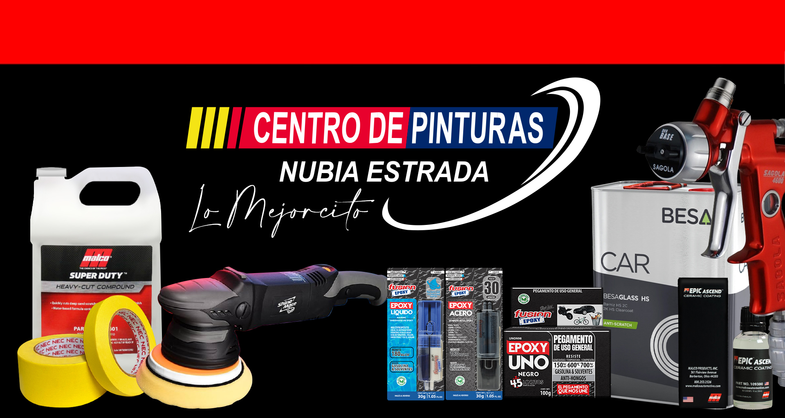

<!DOCTYPE html>
<html lang="en">
<head>
    <meta charset="UTF-8">
    <meta http-equiv="X-UA-Compatible" content="IE=edge">
    <meta name="viewport" content="width=device-width, initial-scale=1">
    <link href="https://fonts.googleapis.com/css?family=Nunito:200,600" rel="stylesheet">
    <link rel="stylesheet" href="https://cdnjs.cloudflare.com/ajax/libs/font-awesome/6.4.0/css/all.min.css" integrity="sha512-iecdLmaskl7CVkqkXNQ/ZH/XLlvWZOJyj7Yy7tcenmpD1ypASozpmT/E0iPtmFIB46ZmdtAc9eNBvH0H/ZpiBw==" crossorigin="anonymous" referrerpolicy="no-referrer" />
    <link href="https://cdn.jsdelivr.net/npm/bootstrap@5.3.8/dist/css/bootstrap.min.css" rel="stylesheet" integrity="sha384-sRIl4kxILFvY47J16cr9ZwB07vP4J8+LH7qKQnuqkuIAvNWLzeN8tE5YBujZqJLB" crossorigin="anonymous">
    <link rel="stylesheet" href="https://unpkg.com/flickity@2/dist/flickity.min.css">
    <link rel="stylesheet" href="https://maxst.icons8.com/vue-static/landings/line-awesome/line-awesome/1.3.0/css/line-awesome.min.css">
    <link href="https://fonts.googleapis.com/css2?family=Inter:wght@400;700&display=swap" rel="stylesheet"> 
    <link rel="stylesheet" type="text/css" href="assets/css/standar.css">
    <link rel="shortcut icon" href="favicon.ico"/>
    <title>::: Centro de Pinturas Nubia Estrada</title>
</head>
<body id="page-top" class="bg-black">
    

    <section id="nbar" class="p-0" class="sec-navbar">
        <nav class="navbar navbar-expand-lg bg-black px-0 fixed-top" id="navTop">
            

                <button class="navbar-toggler bg-white" type="button" data-bs-toggle="collapse" data-bs-target="#navbarCollapse" aria-controls="navbarCollapse" aria-expanded="false" aria-label="Toggle navigation">
                    
                </button>
                

                    
                    <ul class="navbar-nav mr-auto mt-2 mt-lg-0">
                        <li class="nav-item">
                            <a class="nav-link nlink" href="#page-top" aria-current="page">Inicio</a>
                        </li>
                        <li class="nav-item">
                            <a class="nav-link nlink" href="#products">Productos</a>
                        </li>
                        <li class="nav-item">
                            <a class="nav-link nlink" href="#testimony">Testimonios</a>
                        </li>
                        <!-- <li class="nav-item">
                            <a class="nav-link nlink" href="#team">Equipo</a>
                        </li> -->
                        <li class="nav-item">
                            <a class="nav-link nlink" href="#contact">Contactenos</a>
                        </li>
                        <li class="nav-item">
                            <a class="nav-link nlink" href="#aboutus">Nosotros</a>
                        </li>
                    </ul>
                

                <button class="btnShop m-1 bg-white">
                    <svg xmlns="http://www.w3.org/2000/svg" width="16" height="16" fill="currentColor" class="bi bi-cart-check-fill" viewBox="0 0 16 16" class="sparkle">
                        <path d="M.5 1a.5.5 0 0 0 0 1h1.11l.401 1.607 1.498 7.985A.5.5 0 0 0 4 12h1a2 2 0 1 0 0 4 2 2 0 0 0 0-4h7a2 2 0 1 0 0 4 2 2 0 0 0 0-4h1a.5.5 0 0 0 .491-.408l1.5-8A.5.5 0 0 0 14.5 3H2.89l-.405-1.621A.5.5 0 0 0 2 1zM6 14a1 1 0 1 1-2 0 1 1 0 0 1 2 0m7 0a1 1 0 1 1-2 0 1 1 0 0 1 2 0m-1.646-7.646-3 3a.5.5 0 0 1-.708 0l-1.5-1.5a.5.5 0 1 1 .708-.708L8 8.293l2.646-2.647a.5.5 0 0 1 .708.708"/>
                    </svg>

                    Comprar
                </button>
                <a class="playstore-button" href="https://play.google.com/store/apps/details?id=ni.com.online.pinturasNubiaEstrada&hl=es">
                    <svg xmlns="http://www.w3.org/2000/svg" fill="currentColor" class="icon" viewBox="0 0 512 512">
                        <path d="M99.617 8.057a50.191 50.191 0 00-38.815-6.713l230.932 230.933 74.846-74.846L99.617 8.057zM32.139 20.116c-6.441 8.563-10.148 19.077-10.148 30.199v411.358c0 11.123 3.708 21.636 10.148 30.199l235.877-235.877L32.139 20.116zM464.261 212.087l-67.266-37.637-81.544 81.544 81.548 81.548 67.273-37.64c16.117-9.03 25.738-25.442 25.738-43.908s-9.621-34.877-25.749-43.907zM291.733 279.711L60.815 510.629c3.786.891 7.639 1.371 11.492 1.371a50.275 50.275 0 0027.31-8.07l266.965-149.372-74.849-74.847z"></path>
                    </svg>
                    
                        Descarga en
                        Google Play
                    
                </a>
            

        </nav>
    </section>

    <section id="page-top" class="p-0">
        

            

                

                    
                    
                    
                

                

                    Calidad y precisión en preparación de pinturas
                    Mas de 25 años de experiencia en la preparacion de colores de alta calidad.
                    
                

                

                    Trabajamos con las mejores marcas del mercado
                    Ocupamos siempre los mejores productos para un resultado de alta calidad.
                    
                

            

            <button class="carousel-control-prev" type="button" data-bs-target="#carouselExample" data-bs-slide="prev">
              
              Previous
            </button>
            <button class="carousel-control-next" type="button" data-bs-target="#carouselExample" data-bs-slide="next">
              
              Next
            </button>
          

    </section>

    <section id="products" class="p-0" style="background: rgb(242,243,248);">
        <h2 class="fw-bolder text-center pt-10" style="background: rgb(242,243,248);">Estas son las marcas con las que nosotros trabajamos</h2>
        

            <button id="prev" class="btnSlider">
                <i class="las la-angle-left"></i>
            </button>

            

                <!-- Card -->
                

                    <h4>4.5</h4>
                    <i class="lar la-heart"></i>
                    

                        
                        <!--  -->
                    

                    

                        <h2>NEC</h2>
                        
I show you how to make a card group easily and very functional with the use of flexbox and its magic and JavaScript.

                    

                

                <!-- Card End -->
                
                <!-- Card -->
                

                    <h4>4.4</h4>
                    <i class="lar la-heart"></i>
                    

                        
                        <!--  -->
                    

                    

                        <h2>Bernardo Ecenarro</h2>
                        
I show you how to make a card group easily and very functional with the use of flexbox and its magic and JavaScript.

                    

                

                <!-- Card End -->
                
                <!-- Card -->
                

                    <h4>4.7</h4>
                    <i class="lar la-heart"></i>
                    

                        
                        <!--  -->
                    

                    

                        <h2>Sagola</h2>
                        
I show you how to make a card group easily and very functional with the use of flexbox and its magic and JavaScript.

                    

                

                <!-- Card End -->
                
                <!-- Card -->
                

                    <h4>4.2</h4>
                    <i class="lar la-heart"></i>
                    

                        
                        <!--  -->
                    

                    

                        <h2>Fusion Epoxy</h2>
                        
I show you how to make a card group easily and very functional with the use of flexbox and its magic and JavaScript.

                    

                

                <!-- Card End -->
                
                <!-- Card -->
                

                    <h4>4.1</h4>
                    <i class="lar la-heart"></i>
                    

                        
                        <!--  -->
                    

                    

                        <h2>InnoColor</h2>
                        
I show you how to make a card group easily and very functional with the use of flexbox and its magic and JavaScript.

                    

                

                <!-- Card End -->
            

            <button id="next" class="btnSlider">
                <i class="las la-angle-right"></i>
            </button>
        

    </section>

    <section id="testimony" class="p-0">
        

            

                

                    

                        

                            

                                
                            

                            

                        

                    

                    

                        

                            

                                
                            

                            

                        

                    

                    

                        

                            

                                
                            

                            

                        

                    

                    

                        

                            

                                
                            

                            

                        

                    

                    

                        

                            

                                
                            

                            

                        

                    

                    

                        

                            

                                
                            

                            

                        

                    

                    

                        

                            

                                
                            

                            

                        

                    

                    

                        

                            

                                
                            

                            

                        

                    

                    

                        

                            

                                
                            

                            

                        

                    

                

            

        

    </section>

    <!-- <section id="team" class="p-0" style="background: rgb(242,243,248);">
        <h2 class="fw-bolder text-center pt-10" style="background: rgb(242,243,248);">Te presentamos a nuestro equipo</h2>

        

            <button id="prevt" class="btn">
                <i class="las la-angle-left"></i>
            </button>

            

                

                    
                    

                        <h5 class="card-title">Juan Perez</h5>
                        
El mejor CEO que puede haber.

                    

                

                

                    
                    

                        <h5 class="card-title">Juan Perez</h5>
                        
El mejor CEO que puede haber.

                    

                

                

                    
                    

                        <h5 class="card-title">Juan Perez</h5>
                        
El mejor CEO que puede haber.

                    

                

                

                    
                    

                        <h5 class="card-title">Juan Perez</h5>
                        
El mejor CEO que puede haber.

                    

                

                

                    
                    

                        <h5 class="card-title">Juan Perez</h5>
                        
El mejor CEO que puede haber.

                    

                

                

                    
                    

                        <h5 class="card-title">Juan Perez</h5>
                        
El mejor CEO que puede haber.

                    

                

            

            <button id="nextt" class="btn">
                <i class="las la-angle-right"></i>
            </button>
        

    </section> -->

    <section id="contact" class="p-0 text-white">
        <h2 class="m-10 fw-bolder text-center text-white">Mantente en contacto con nosotros</h2>
        

            

                

                    

                        
Siempre puedes estar en contacto con nosotros utilizando cualquiera de los siguientes medios:

                    

                    

                        

                            <h3 class="font-header-h2 text-white">Nuestros teléfonos</h3>
                            <ul>
                                <li class="font-text-li">Delivery Express: +505 83880152.</li>
                                <li class="font-text-li">Atencion al Cliente: +505 22508708</li>
                            </ul>
                            <h3 class="font-header-h2 text-white">Nuestro correo electrónico</h3>
                            <ul>
                                <li class="font-text-li">Información: info@pinturasnestrada.net</li>
                                <li class="font-text-li">Ventas: ventas@pinturasnestrada.net</li>
                            </ul>
                            <h3 class="font-header-h2 text-white">Donde nos ubicas?</h3>
                             
                            <h4 class="font-header-h2 text-white">Sucursal Managua</h4>
                            
Barrio Campo Bruce, semaforos boer 4 1/2 cuadras arriba, Managua.

                            <iframe src="https://www.google.com/maps/embed?pb=!1m18!1m12!1m3!1d1950.280256012307!2d-86.25810351222752!3d12.142194034637633!2m3!1f0!2f0!3f0!3m2!1i1024!2i768!4f13.1!3m3!1m2!1s0x8f715601dc317c07%3A0x53ade30c62e198ee!2sCentro%20de%20Pinturas%20Nubia%20Estrada!5e0!3m2!1ses!2sni!4v1701865067994!5m2!1ses!2sni" width="100%" height="350" style="border:0;" allowfullscreen="" loading="lazy" referrerpolicy="no-referrer-when-downgrade"></iframe>
                             
                            <h4 class="font-header-h2 text-white">Sucursal Chinandega</h4>
                            <iframe src="https://www.google.com/maps/embed?pb=!1m18!1m12!1m3!1d4699.3446415283815!2d-87.13625042421592!3d12.62777632232164!2m3!1f0!2f0!3f0!3m2!1i1024!2i768!4f13.1!3m3!1m2!1s0x8f70f1a23c49fd4b%3A0x7e7a17982ded2833!2sCentro%20de%20Pinturas%20Nubia%20Estrada%20Chinandega!5e1!3m2!1ses-419!2sni!4v1758254436676!5m2!1ses-419!2sni" width="100%" height="350" style="border:0;" allowfullscreen="" loading="lazy" referrerpolicy="no-referrer-when-downgrade"></iframe>
                        

                        

                            <h3 class="font-header-h2 text-white">Escribenos directamente</h3>
                            

                                
Nombre:

                                

                                    <input type="text" class="form-control form-control-sm" id="txName">
                                

                            

                            

                                
Teléfono:

                                

                                    <input type="text" class="form-control form-control-sm" id="txPhone">
                                

                            

                            

                                
Correo electrónico:

                                

                                    <input type="text" class="form-control form-control-sm" id="txEmail">
                                

                            

                            

                                
Asunto:

                                

                                    <textarea type="text" class="form-control form-control-sm" id="txMessage"></textarea>
                                

                            

                            

                                

                                

                                    <a class="btn btn-success btn-lg w-100 mt-1" href="#">
                                        <i class="fa-solid fa-paper-plane"></i> | Enviar
                                    </a>
                                

                            

                            

                                <h3 class="mt-3 font-header-h2 text-white">Ó nos puedes seguir por nuestras redes sociales</h3>
                            

                            

                                <ul class="wrapperSocial">
                                    <li class="icon facebook">
                                        Facebook
                                        <svg viewBox="0 0 320 512" height="1.2em" fill="black" xmlns="http://www.w3.org/2000/svg">
                                            <path d="M279.14 288l14.22-92.66h-88.91v-60.13c0-25.35 12.42-50.06 52.24-50.06h40.42V6.26S260.43 0 225.36 0c-73.22 0-121.08 44.38-121.08 124.72v70.62H22.89V288h81.39v224h100.17V288z"></path>
                                        </svg>
                                    </li>
                                    <li class="icon twitter">
                                        X
                                        <svg xmlns="http://www.w3.org/2000/svg" width="16" height="16" fill="black" class="bi bi-twitter-x" viewBox="0 0 16 16" class="twitter">
                                            <path d="M12.6.75h2.454l-5.36 6.142L16 15.25h-4.937l-3.867-5.07-4.425 5.07H.316l5.733-6.57L0 .75h5.063l3.495 4.633L12.601.75Zm-.86 13.028h1.36L4.323 2.145H2.865z"/>
                                        </svg>
                                    </li>
                                    <li class="icon instagram">
                                        Instagram
                                        <svg xmlns="http://www.w3.org/2000/svg" height="1.2em" fill="black" class="bi bi-instagram" viewBox="0 0 16 16">
                                            <path d="M8 0C5.829 0 5.556.01 4.703.048 3.85.088 3.269.222 2.76.42a3.917 3.917 0 0 0-1.417.923A3.927 3.927 0 0 0 .42 2.76C.222 3.268.087 3.85.048 4.7.01 5.555 0 5.827 0 8.001c0 2.172.01 2.444.048 3.297.04.852.174 1.433.372 1.942.205.526.478.972.923 1.417.444.445.89.719 1.416.923.51.198 1.09.333 1.942.372C5.555 15.99 5.827 16 8 16s2.444-.01 3.298-.048c.851-.04 1.434-.174 1.943-.372a3.916 3.916 0 0 0 1.416-.923c.445-.445.718-.891.923-1.417.197-.509.332-1.09.372-1.942C15.99 10.445 16 10.173 16 8s-.01-2.445-.048-3.299c-.04-.851-.175-1.433-.372-1.941a3.926 3.926 0 0 0-.923-1.417A3.911 3.911 0 0 0 13.24.42c-.51-.198-1.092-.333-1.943-.372C10.443.01 10.172 0 7.998 0h.003zm-.717 1.442h.718c2.136 0 2.389.007 3.232.046.78.035 1.204.166 1.486.275.373.145.64.319.92.599.28.28.453.546.598.92.11.281.24.705.275 1.485.039.843.047 1.096.047 3.231s-.008 2.389-.047 3.232c-.035.78-.166 1.203-.275 1.485a2.47 2.47 0 0 1-.599.919c-.28.28-.546.453-.92.598-.28.11-.704.24-1.485.276-.843.038-1.096.047-3.232.047s-2.39-.009-3.233-.047c-.78-.036-1.203-.166-1.485-.276a2.478 2.478 0 0 1-.92-.598 2.48 2.48 0 0 1-.6-.92c-.109-.281-.24-.705-.275-1.485-.038-.843-.046-1.096-.046-3.233 0-2.136.008-2.388.046-3.231.036-.78.166-1.204.276-1.486.145-.373.319-.64.599-.92.28-.28.546-.453.92-.598.282-.11.705-.24 1.485-.276.738-.034 1.024-.044 2.515-.045v.002zm4.988 1.328a.96.96 0 1 0 0 1.92.96.96 0 0 0 0-1.92zm-4.27 1.122a4.109 4.109 0 1 0 0 8.217 4.109 4.109 0 0 0 0-8.217zm0 1.441a2.667 2.667 0 1 1 0 5.334 2.667 2.667 0 0 1 0-5.334z"></path>
                                        </svg>
                                    </li>
                                    <li class="icon tiktok">
                                        Tiktok
                                        <svg xmlns="http://www.w3.org/2000/svg" width="16" height="16" fill="black" class="bi bi-tiktok" viewBox="0 0 16 16" class="tiktok">
                                            <path d="M9 0h1.98c.144.715.54 1.617 1.235 2.512C12.895 3.389 13.797 4 15 4v2c-1.753 0-3.07-.814-4-1.829V11a5 5 0 1 1-5-5v2a3 3 0 1 0 3 3z"/>
                                        </svg>
                                    </li>
                                    <li class="icon youtube">
                                        Youtube
                                        <svg xmlns="http://www.w3.org/2000/svg" width="16" height="16" fill="black" class="bi bi-youtube" viewBox="0 0 16 16" class="youtube">
                                            <path d="M8.051 1.999h.089c.822.003 4.987.033 6.11.335a2.01 2.01 0 0 1 1.415 1.42c.101.38.172.883.22 1.402l.01.104.022.26.008.104c.065.914.073 1.77.074 1.957v.075c-.001.194-.01 1.108-.082 2.06l-.008.105-.009.104c-.05.572-.124 1.14-.235 1.558a2.01 2.01 0 0 1-1.415 1.42c-1.16.312-5.569.334-6.18.335h-.142c-.309 0-1.587-.006-2.927-.052l-.17-.006-.087-.004-.171-.007-.171-.007c-1.11-.049-2.167-.128-2.654-.26a2.01 2.01 0 0 1-1.415-1.419c-.111-.417-.185-.986-.235-1.558L.09 9.82l-.008-.104A31 31 0 0 1 0 7.68v-.123c.002-.215.01-.958.064-1.778l.007-.103.003-.052.008-.104.022-.26.01-.104c.048-.519.119-1.023.22-1.402a2.01 2.01 0 0 1 1.415-1.42c.487-.13 1.544-.21 2.654-.26l.17-.007.172-.006.086-.003.171-.007A100 100 0 0 1 7.858 2zM6.4 5.209v4.818l4.157-2.408z"/>
                                        </svg>
                                    </li>
                                </ul>
                            

                            

                            

                            

                            

                            

                            

                        

                    

                

            

        

    </section>

    <nav class="navbar fixed-bottom navbar-expand-lg navbar-white bg-white justify-content-center border-top">
        

            
Todos los derechos reservados por Centro de Pinturas Nubia Estrada © 2023

        

    </nav>

    
    
    
    
    
    
    
</body>
</html>